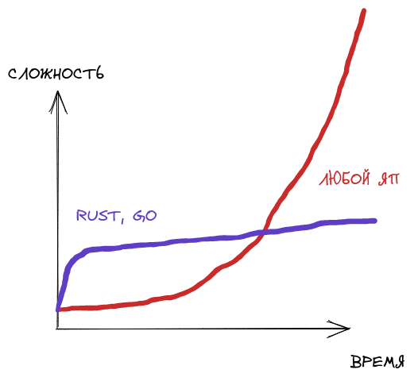

# Язык FSM

## Зачем?
Несмотря на изящество решений, использующих конечные автоматы в Verilog, нельзя не отметить 
их громоздкость и, порой, избыточность в плане написания кода, поэтому необходимо
удобное и более лаконичное средство описания Verilog-кода как конечного автомата.  

## Почему Rust? Почему Nom?
Причины использовать Rust:
1. Возможность в перспективе использовать макросы, которые смогут полностью парсить предложения
  at compile time. 
2. Более сглаженная кривая роста сложности программ (дискуссионный вопрос)
  

Причины НЕ использовать Rust:
1. Не так много библиотек.
2. Что еще важнее - не так много генераторов парсеров. Bison и antlr сюда не завезли

### А какой парсер собственно говоря нам нужен?
Рассмотрим имеющиеся варианты написания парсера для решения данной задачи:
1. Полностью cамописный
2. Генератор парсеров 
3. Самописный с ипользованием комбинаторных библиотек.

1-ый вариант плох ощутимо высокими издержками времени. 

2-ой вариант плох тем, что не будет комфортных сообщений об ошибках + при необходимости
исправить обход/добавить какие-то дополнительные действия в правила, разработчик будет
ограничен в тех точках расширения, которые предоставляет конкретная библиотека

3-ий вариант все так же имеет высокие издержки времени, но они гораздо меньше чем в первом варианте, но при
сохранении всех достоинств первого варианта.

В связи с вышеперечисленным, было принято решение использовать 3-ий подход и библиотеку NOM для его реализации.

// Архитектура

// Что транслятору можно подать на вход и как он реагирует на ошибки
