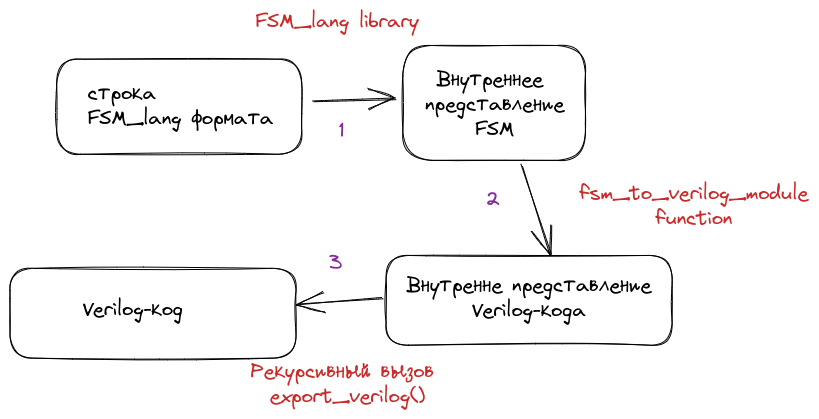

# Архитектура 




## 1 шаг
На первом шаге строка, записанная в языке FSM_lang парсится во
внутреннее представление FSM (Finite State Machine) посредством вызова
функции ``FSM_parse``.

```rust
let str: &str;
let result = FSM_parse(str)?;
```

## 2 шаг
Из внутреннего представления FSM (Finite State Machine) посредством вызова 
функции ``fsm_to_verilog_module``

```rust
let str: &str;
let resultFSM = FSM_parse(str)?;
let resultModule = fsm_to_verilog_module(resultFSM)?; 
```
## 3 шаг
Из внутреннего представления Verilog-модуля, получаем конечную строку с 
Verilog-кодом.

```rust
let str: &str;
let resultFSM = FSM_parse(str)?;
let resultModule = fsm_to_verilog_module(resultFSM)?; 
let resultString = resultModule.export_verilog();
```
